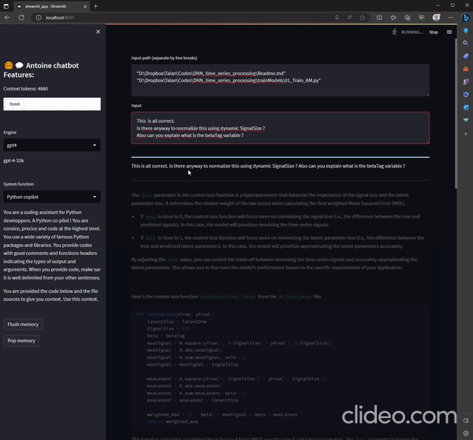

# CodeConverser: Python Co-Pilot Chatbot



This repository contains a Streamlit-based chatbot application that leverages the power of OpenAI's GPT models to assist Python developers with their coding tasks. The chatbot can provide code snippets, answer questions, and help with various programming tasks.

The chatbot reads your code files continously to help you improve on it. You can interact with it using speech or typed text. HTML display makes the chatbot response easy to read.

I started this repo because Github-copilot is not integrated in my favorite IDE. So I figured I'd do something similar, with no integration.

## Features

- Multiple modes: coder, code commenter, simple chatbot, and Python copilot
- Python copilot mode allows inputting file paths to interact with your codebase, providing context-aware assistance
- Automatic updates and loading of provided code files in Python copilot mode
- Streamlit-based user interface with speech-to-text and text input options for interaction
- Python code generation and assistance
- In-context code commenting and documentation
- Support for multiple GPT models
- Automatic and dynamic context size management to avoid overflowing context tokens

## Repository Structure

```
.
├── streamlit_app.py          # Streamlit frontend application
├── chatbot_streamlit.py      # Backend chatbot logic and interaction with OpenAI API
├── openia_config.txt         # OpenAI API configuration file
├── Dockerfile                # Dockerfile for containerizing the application
└── README.md                 # This README file
```

## Installation

1. Clone the repository:

```bash
git clone https://github.com/yourusername/python-copilot-chatbot.git
cd python-copilot-chatbot
```

2. Create a virtual environment and activate it:

```bash
python -m venv venv
source venv/bin/activate  # For Windows: venv\Scripts\activate
```

3. Install the required packages:

```bash
pip install -r requirements.txt
```

4. Set up your OpenAI API key. You can obtain an API key from the [OpenAI website](https://beta.openai.com/signup/). Save your API key in the `openia_config.txt` file.

```
openai.api_type = <api host>
openai.api_base = <api deployement ressource>
openai.api_version = 2023-03-15-preview
openai.api_key = <your api_key>
```

## Usage

1. Run the Streamlit application:

```bash
streamlit run streamlit_app.py
```

2. Open the provided URL in your web browser to access the chatbot interface.

3. Interact with the chatbot by typing your questions or code requests in the input area, or use the speech-to-text feature.

4. You can also provide file paths to Python files in your project to give the chatbot context about your codebase.

## Dockerization

To containerize the application using Docker, follow these steps:

1. Make sure you have [Docker](https://www.docker.com/) installed on your system.

2. Build the Docker image:

```bash
docker build -t python-copilot-chatbot .
```

3. Run the Docker container:

```bash
docker run -p 8501:8501 python-copilot-chatbot
```

4. Open your web browser and navigate to `http://localhost:8501` to access the chatbot interface.

## Contributing

Contributions are welcome! Please feel free to submit issues or pull requests to improve the chatbot's functionality and performance.

## License
This project is licensed under the MIT License.